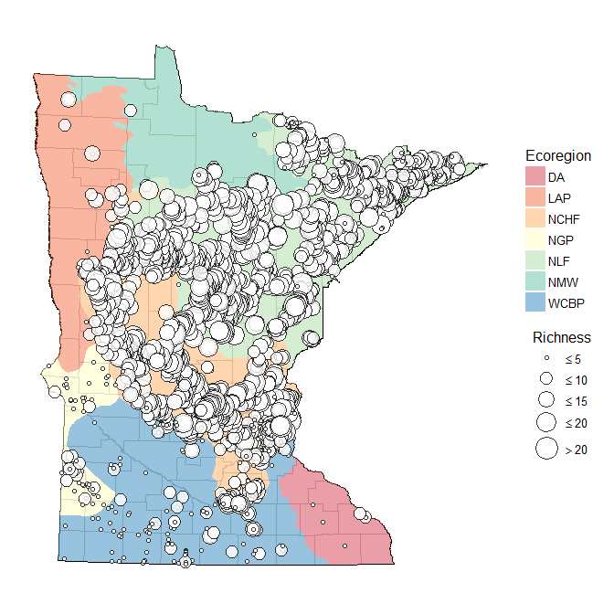

# README
Marcus W. Beck, beck.marcus@epa.gov, Janne Alahuhta, Janne.Alahuhta@oulu.fi  

### Files

* `ecoregs.RData` SpatialPolygonsDataFrame for MN ecoregions
* `mncounties.RData` SpatialPolygonsDataFrame for MN counties
* `mnstate.RData` SpatialPolygonsDataFrame for state outline
* `veg_dat.RData` DNR vegetation transect data from 1992 to 2014, created in `fishveg.RProj`, combination of nrri processed data, current transect data, and gaps filled with another file
* `veg_rch.RData` Summarized vegetation richness data from veg_dat, includes total richness (`richtot`), submersed species richness (`richsub`), presence/absence of coontail (as 1/0, `cd_pres`), presence/absence of curly-leaf (`pc_pres`), presence/absence of milfoil (`ms_pres`), and richness of native submersed species (`richnat`). Scientific names were manually verified during processing to remove duplicates (all species had scientific names except 'filamentous algae', 'planktonic algae', and 'Fern group', these were removed - 2642 records out of 894920 ~0.3% of total)

### Model examples

#### Exploratory analysis

Maps showing speices richness of pecies richness of submersed macrophytes from MNDNR transect database (top) and presence/absence of the invasives M. spicatum and P. crispus (bottom).



```r
library(mgcv)
data(veg_rch)

# add covariate data
covdat <- read.table('ignore/MNDNRwatersheds.txt', sep = ',', header = T)

dat <- mutate(veg_rch, DOWNUM = as.integer(gsub('[0-9][0-9]$', '', dow))) %>% 
  left_join(., covdat, by = 'DOWNUM') %>% 
  select(dow, date, richtot, richsub, cd_pres, pc_pres, ms_pres, richnat, depthft, LKACRES, MeanTotalP, secchi, alkalinity) %>% 
  # unite('facs', cd_pres, pc_pres, ms_pres, sep = '') %>% 
  unite('facs', pc_pres, ms_pres, sep = '') %>% 
  mutate(facs = factor(facs, 
    levels = c('00', '10', '01', '11'), 
    labels = c('none', 'pc', 'ms', 'all')
    # labels = c('none', 'cd', 'pc', 'ms', 'cd, pc', 'pc, ms', 'cd, ms', 'all')
    )
  )

tmp2 <- gam(log(1 + richnat) ~ te(log(LKACRES), log(1 + MeanTotalP), by = facs, bs = c("tp", "tp")), data = dat)
tmp1 <- gam(log(1 + richnat) ~ te(log(LKACRES), log(1 + MeanTotalP), bs = c("tp", "tp")), data = dat)
# select one survey date per lake, or use gamm
# setup logit model for individual species
```


### To Do

* Create combined veg transect dataset with covariates from Cross paper
* Check with Cross to see if we can use the dataset
* Run simple GAM looking at effect of curly-leaf, milfoil, and coontail on ind species, fixed and interactions (tensor product)
* a block design (lakes w/ and w/o invasives, etc.)
