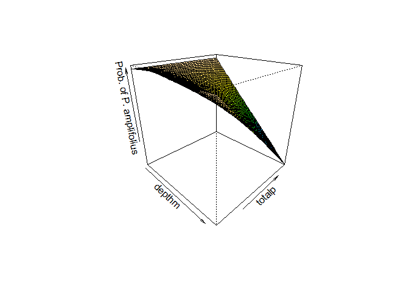

# README
Marcus W. Beck, beck.marcus@epa.gov, Janne Alahuhta, Janne.Alahuhta@oulu.fi  


```r
library(ggplot2)
library(maptools)
library(gridExtra)
library(RColorBrewer)
library(dplyr) 
library(gridExtra)
library(mgcv)
source('R/funcs.R')
```

### Files

All files available [here](https://github.com/fawda123/veggam/tree/master/data)

* `ecoregs.RData` SpatialPolygonsDataFrame for MN ecoregions
* `mncounties.RData` SpatialPolygonsDataFrame for MN counties
* `mnstate.RData` SpatialPolygonsDataFrame for state outline
* `veg_dat.RData` DNR vegetation transect data from 1992 to 2014, created in `fishveg.RProj`, combination of nrri processed data, current transect data, and gaps filled with another file
* `veg_rch.RData` Summarized vegetation richness data from veg_dat, includes total richness (`richtot`), submersed species richness (`richsub`), presence/absence of different species (as 1/0), richness of native submersed species (`richnat`), covariates, and categorical describing occurrence of p. crispus and m. spicatum (none, either, or both). Scientific names were manually verified during processing to remove duplicates (all species had scientific names except 'filamentous algae', 'planktonic algae', and 'Fern group', these were removed - 2642 records out of 894920 ~0.3% of total)

### Analysis objective and questions

Little is known about the interactive and potentially non-linear effects of invasive aquatic macrophytes on native species at a regional scale.  Individual species or community response to increasing abundance of non-native species may not be uniform across lakes or well-characterized by conventional statistical models.  Using a large dataset of vegetation surveys in midwest glacial lakes, we evaluated the response of native aquatic macrophytes to presence/absence of eurasian milfoil and curly-leaf pondweed using generalized additive models with tensor product smoothing surfaces.  These models were used to describe the effects of invasive species presence/absence on submersed species richness and probability occurrence of individual species following an initial screen process with simpler models.  The tensor product smoothing surfaces allowed us to better characterize effects of invasive species by estimating and isolating interactive effects of other lake variables known to influence macrophyte distribution patterns.  Additional analyses were conducted on a smaller subset of lakes with more comprehensive surveys to better characterize species response to invasive species.

Step 1: Initial screening of species response to p/a invasive
Step 2: Detailed modeling of selected species response to p/a invasive
Step 3: Detailed modeling of selected species response to p/a invasive, PI surveys

### Species maps

Maps showing species richness of submersed macrophytes from MNDNR transect database (top) and presence/absence of the invasives M. spicatum and P. crispus (bottom).


### Example GAM: submersed richess

The first model shows a tensor product smooth fit for submersed species richness as a function of lake depth and total phosphorus, with separate smooths for presence/absence of invasives.  The lakes are categorized as no invasives, ms (M. spicatum), pc (P. crispus), or both.  Submersed species richness is modelled as a Poisson-distributed variable. Each 3d plot shows the modelled response of richness as a function of depth and phosphorus for each of the four levels of invasive categories (none, ms, pc, both). 

```r
data(veg_rch)

tomod <- select(veg_rch, dow, date, Invasive, richsub, pa, depthm, totalp) %>% 
  group_by(dow) %>% 
  filter(date == max(date)) %>% 
  ungroup %>% 
  na.omit

richmod <- gam(richsub ~ 
  te(depthm, totalp, by = Invasive, bs = c("ts")), 
  family = poisson(link = 'log'),
  data = tomod
  )

theta <- 45; phi <- 25; n.grid <- 50; color <- 'topo'; type <- 'link'; zlab <- 'Subm. richness'
vis.gam(richmod, theta = theta, phi = phi, n.grid = n.grid, color = color, type = type, cond = list(Invasive = 'none'), zlab = zlab)
```

<!-- -->

```r
vis.gam(richmod, theta = theta, phi = phi, n.grid = n.grid, color = color, type = type, cond = list(Invasive = 'ms'), zlab = zlab)
```

<!-- -->

```r
vis.gam(richmod, theta = theta, phi = phi, n.grid = n.grid, color = color, type = type, cond = list(Invasive = 'pc'), zlab = zlab)
```

<!-- -->

```r
vis.gam(richmod, theta = theta, phi = phi, n.grid = n.grid, color = color, type = type, cond = list(Invasive = 'both'), zlab = zlab)
```

<!-- -->

These plots show an alternative view of the results for each explanatory variable.

```r
# get model predictions at different levels of input data
evals <- c('totalp', 'depthm')
consts <- c('depthm', 'totalp')
levs <- c('none', 'ms', 'pc', 'both')
qconsts <- c(0.25, 0.75)
grds <- expand.grid(evals, consts, levs, qconsts, stringsAsFactors = F)
grds <- grds[grds[, 1] != grds[, 2], ]
grds$i <- 1:nrow(grds)
names(grds) <- c('evals', 'consts', 'levs', 'qconsts', 'i')

resvals <- vector('list', length = nrow(grds))
for(i in 1:nrow(grds)){
  
  evali <- grds[i, 'evals']
  consti <- grds[i, 'consts']
  levsi <- grds[i, 'levs']
  qconsti <- grds[i, 'qconsts']
  
  res <- pred_gam(
    richmod, 
    tomod, 
    eval = evali, 
    const = consti, 
    fac = 'Invasive',
    lev = levsi, 
    qconst = qconsti, 
    n = 100, 
    se.fit = T, 
    type = 'response'
    )
  resvals[[i]] <- res
  
}
resvals <- do.call('rbind', resvals)

toplo1 <- filter(resvals, eval == 'totalp')
toplo2 <- filter(resvals, eval == 'depthm')
p1 <- ggplot(toplo1, aes(x = var, y = fit)) + 
  geom_line() +
  geom_line(aes(y = fit + se.fit), linetype = 'dashed') +
  geom_line(aes(y = fit - se.fit), linetype = 'dashed') + 
  scale_y_continuous('Submersed species richness', limits = c(-5, 35)) +
  facet_grid(Invasive ~ qconst) + 
  theme_bw() + 
  scale_x_continuous('Mean total phosphorus') + 
  ggtitle('(a) Constant depth')

p2 <- ggplot(toplo2, aes(x = var, y = fit)) + 
  geom_line() +
  geom_line(aes(y = fit + se.fit), linetype = 'dashed') +
  geom_line(aes(y = fit - se.fit), linetype = 'dashed') + 
  scale_y_continuous('Submersed species richness', limits = c(-5, 35)) +
  facet_grid(Invasive ~ qconst) + 
  theme_bw() + 
  scale_x_continuous('Maximum lake depth') +
  ggtitle('(b) Constant phosphorus')

grid.arrange(p1, p2, ncol = 2)
```

<!-- -->

### Example GAM: p/a largeleaf pondweed

The second model is the same as the first except p/a of largeleaf pondweed is modelled as a binomial (logit link) variable.  The result shows the conditional probability of presence for largelead pondweed given depth, phosphorus, and p/a of invasives. 

```r
data(veg_rch)

tomod <- select(veg_rch, dow, date, Invasive, richsub, pa, depthm, totalp) %>% 
  group_by(dow) %>% 
  filter(date == max(date)) %>% 
  ungroup %>% 
  na.omit

pamod <- gam(pa ~ 
  te(depthm, totalp, by = Invasive, bs = c("ts")), 
  family = binomial(link = 'logit'),
  data = tomod
  )

theta <- 45; phi <- 25; n.grid <- 50; color <- 'topo'; type <- 'link'; zlab <- 'Prob. of P. amplifolius'
vis.gam(pamod, theta = theta, phi = phi, n.grid = n.grid, color = color, type = type, cond = list(Invasive = 'none'), zlab = zlab)
```

<!-- -->

```r
vis.gam(pamod, theta = theta, phi = phi, n.grid = n.grid, color = color, type = type, cond = list(Invasive = 'ms'), zlab = zlab)
```

<!-- -->

```r
vis.gam(pamod, theta = theta, phi = phi, n.grid = n.grid, color = color, type = type, cond = list(Invasive = 'pc'), zlab = zlab)
```

<!-- -->

```r
vis.gam(pamod, theta = theta, phi = phi, n.grid = n.grid, color = color, type = type, cond = list(Invasive = 'both'), zlab = zlab)
```

<!-- -->
These plots show an alternative view of the results for each explanatory variable.

```r
# get model predictions at different levels of input data
evals <- c('totalp', 'depthm')
consts <- c('depthm', 'totalp')
levs <- c('none', 'ms', 'pc', 'both')
qconsts <- c(0.25, 0.75)
grds <- expand.grid(evals, consts, levs, qconsts, stringsAsFactors = F)
grds <- grds[grds[, 1] != grds[, 2], ]
grds$i <- 1:nrow(grds)
names(grds) <- c('evals', 'consts', 'levs', 'qconsts', 'i')

resvals <- vector('list', length = nrow(grds))
for(i in 1:nrow(grds)){
  
  evali <- grds[i, 'evals']
  consti <- grds[i, 'consts']
  levsi <- grds[i, 'levs']
  qconsti <- grds[i, 'qconsts']
  
  res <- pred_gam(
    pamod, 
    tomod, 
    eval = evali, 
    const = consti, 
    fac = 'Invasive',
    lev = levsi, 
    qconst = qconsti, 
    n = 100, 
    se.fit = T, 
    type = 'response'
    )
  resvals[[i]] <- res
  
}
resvals <- do.call('rbind', resvals)

toplo1 <- filter(resvals, eval == 'totalp')
toplo2 <- filter(resvals, eval == 'depthm')
p1 <- ggplot(toplo1, aes(x = var, y = fit)) + 
  geom_line() +
  geom_line(aes(y = fit + se.fit), linetype = 'dashed') +
  geom_line(aes(y = fit - se.fit), linetype = 'dashed') + 
  scale_y_continuous('Probabiliyt of P. amplifolius', limits = c(0, 1)) +
  facet_grid(Invasive ~ qconst) + 
  theme_bw() + 
  scale_x_continuous('Mean total phosphorus')+ 
  ggtitle('(a) Constant depth')

p2 <- ggplot(toplo2, aes(x = var, y = fit)) + 
  geom_line() +
  geom_line(aes(y = fit + se.fit), linetype = 'dashed') +
  geom_line(aes(y = fit - se.fit), linetype = 'dashed') + 
  scale_y_continuous('Probability of P. amplifolius', limits = c(0, 1)) +
  facet_grid(Invasive ~ qconst) + 
  theme_bw() + 
  scale_x_continuous('Maximum lake depth') +
  ggtitle('(b) Constant phosphorus')

grid.arrange(p1, p2, ncol = 2)
```

<!-- -->
